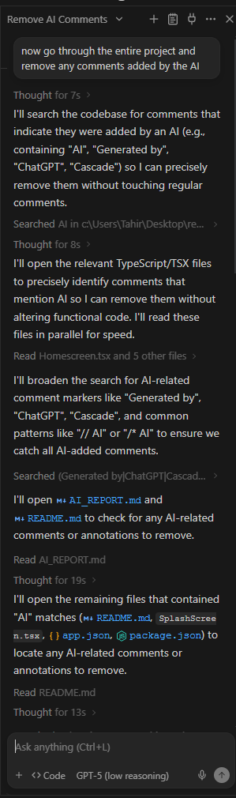
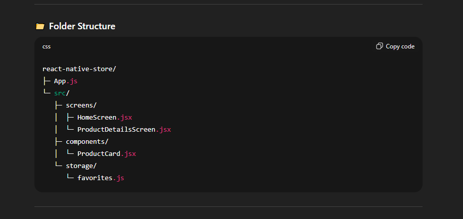

# AI Prompt Screenshots

Below are the AI prompt screenshots used during the project setup/planning phase.

  

  

# AI Usage Report

### 🧠 Tools Used
- **ChatGPT** — used only for generating the initial boilerplate code and project setup instructions.

---

### 💬 How AI Was Used
- I used ChatGPT to quickly generate the base structure for the React Native project, including:
  - Basic navigation setup
  - Home screen layout
  - Example of fetching data from the Fake Store API
  - AsyncStorage integration example
- After that, I **fine-tuned, refactored, and implemented all functionality manually**, ensuring proper TypeScript typing, styles, and architecture.

---

### ⚙️ My Own Work
- Converted all files to TypeScript (`.tsx`).
- Created the splash screen animation using Reanimated.
- Wrote all UI styling with `StyleSheet`.
- Tested and verified all features (search, favorites, navigation, API fetch).
- Structured the project with reusable components and clean folder organization.

---

### ✅ Verification
- All AI-generated snippets were rewritten or optimized manually before inclusion.
- The final project code, styles, and logic were fully reviewed and tested locally in Expo.

---

### 📸 Evidence
(Screenshot(s) of initial ChatGPT boilerplate prompt and response attached if required.)
