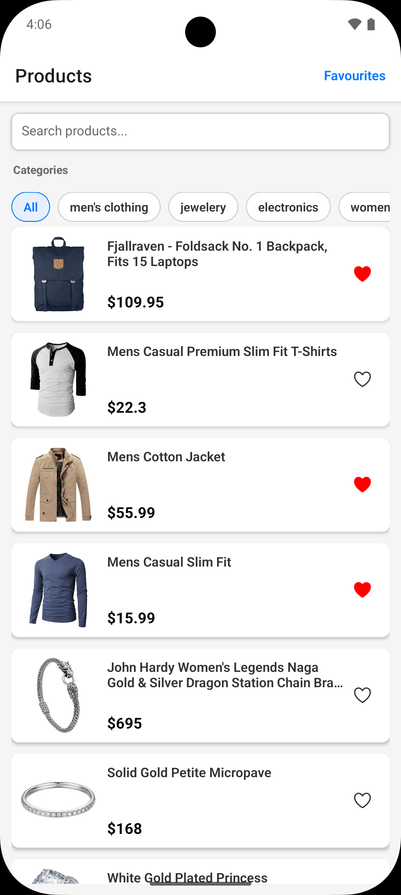
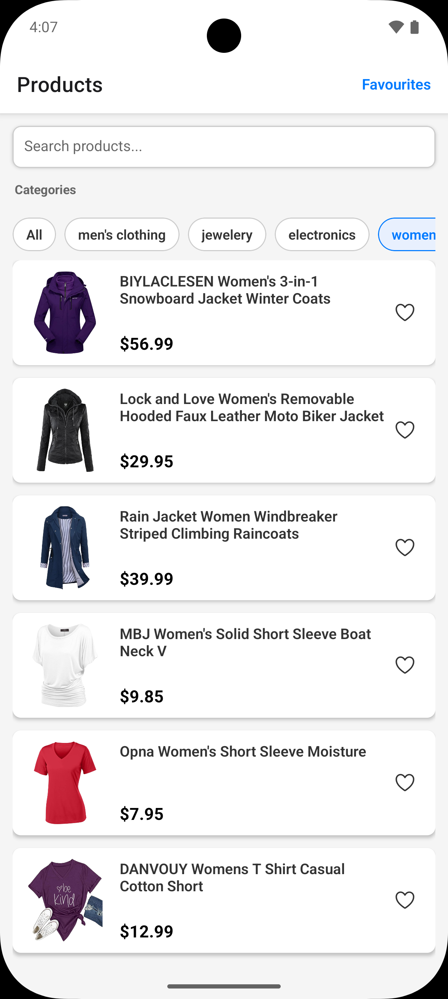
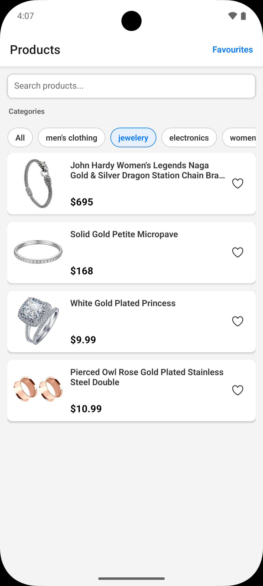
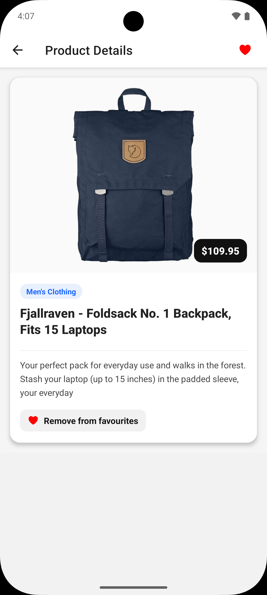

# React Native Assessment

Modern React Native app built with Expo. Browse products, search and filter by category, view details, and manage favourites. Includes a custom splash flow and polished UI.

## Features

- **Product list** with search and real‑time category filters (`src/screens/Homescreen.tsx`)
- **Product details** with improved layout and favourite toggle (`src/screens/ProductDetailsScreen.tsx`)
- **Favourites** screen persisted with AsyncStorage (`src/screens/FavoritesScreen.tsx`, `src/storage/Favourites.ts`)
- **Startup splash** route that shows for ~3 seconds before navigating to Home (`App.tsx`, `src/screens/SplashScreen.tsx`)
- TypeScript, ESLint, and React Navigation

## Tech Stack

- React Native, Expo
- React Navigation (native stack)
- AsyncStorage
- Reanimated (for splash animation)
- TypeScript, ESLint

## Screenshots

<div align="center">
  
  
  
  
  
  
</div>

## Project Structure

```
.
├─ App.tsx                     # Navigation + splash route
├─ index.js                    # Expo entry (registers App)
├─ app.json                    # Expo config
├─ src/
│  ├─ components/
│  │  └─ ProductCard.tsx
│  ├─ screens/
│  │  ├─ Homescreen.tsx
│  │  ├─ ProductDetailsScreen.tsx
│  │  ├─ FavoritesScreen.tsx
│  │  └─ SplashScreen.tsx
│  ├─ storage/
│  │  └─ Favourites.ts
│  └─ types.ts
└─ assets/
   └─ images/
      └─ splashScreenImage.png
```

## Getting Started

1. Install dependencies

   ```bash
   npm install
   ```

2. Start Metro and choose a platform

   ```bash
   npm run android
   # or
   npm run ios
   # or
   npm start
   ```

3. Open on device/emulator when prompted.

## Scripts

- `npm start` – start Expo dev server
- `npm run android` – run on Android
- `npm run ios` – run on iOS
- `npm run web` – run on web
- `npm run lint` – run ESLint

## Splash Behavior

- Native splash is controlled by `expo-splash-screen` in `app.json`.
- JS shows a dedicated `Splash` route first, then automatically navigates to `Home` after ~3 seconds.
- Splash image: `assets/images/splashScreenImage.png`. Update this asset to change the visual.

## Favourites Persistence

- Stored as a map `Record<number, boolean>` in AsyncStorage under key `FAVORITES_V1`.
- Helpers in `src/storage/Favourites.ts`: `getFavorites`, `setFavorites`, `toggleFavorite`.

## Troubleshooting

- If splash never hides: ensure `ExpoSplash.hideAsync()` is called in `App.tsx` and the Splash route performs a timed navigation.
- If images don’t load: check network permissions/emulator connectivity.
- If the splash image errors, verify the file path/extension and that the asset exists at `assets/images/splashScreenImage.png`.

## License

This project is for assessment and educational purposes.
